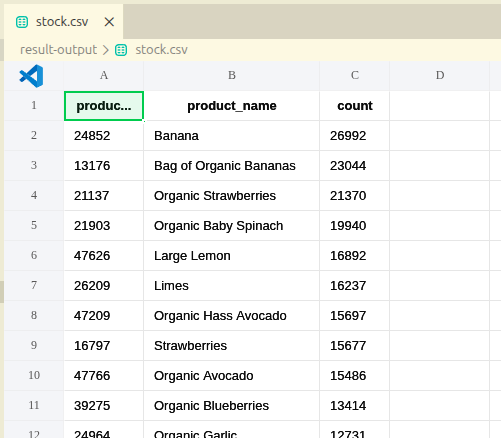
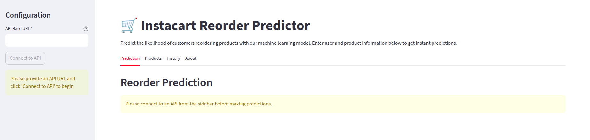

# Instacart Product Stock Prediction

**Repository**: [https://github.com/MrGladiator14/instacart-recommendation](https://github.com/MrGladiator14/instacart-recommendation)

**Advanced ML-powered system for predicting consumer reorder behavior to optimize supply chains and enhance customer experience in the FMCG/Retail sector.**

---

## Overview

### Problem Statement

Predict consumer reorder behavior to pre-populate shopping carts and optimize inventory management for the Instacart online grocery platform, serving 200K+ users across 50K+ products with 3M+ order history.

### Solution Architecture

Built a scalable end-to-end ML pipeline leveraging gradient-boosted trees (XGBoost/LightGBM) with sophisticated feature engineering including temporal patterns, user-product interactions, and semantic product analysis to achieve high-accuracy reorder probability predictions.

### Key Achievements

- **Scalable Data Processing**: Handled 32M+ rows through chunked reading and strategic sampling
- **Advanced Feature Engineering**: 20+ engineered features spanning user behavior, product metadata, and temporal patterns
- **Multi-Model Approach**: XGBoost, LightGBM, and Logistic Regression with automatic model selection
- **Production-Ready Deployment**: FastAPI + Ray Serve + Streamlit for real-time inference and interactive visualization
- **Live Deployment**: Interactive web application available at [https://instacart-reorder-prediction.streamlit.app/](https://instacart-reorder-prediction.streamlit.app/)

---

## Project Visual Overview

### Final Stock Requirement Predicted



### Live Application Demo

**Try it now**: [https://instacart-reorder-prediction.streamlit.app/](https://instacart-reorder-prediction.streamlit.app/)



### Project Management & Architecture

**Agile Board**: [Jira-like Scrum Board](https://www.notion.so/Agile-Scrum-Board-185d600e6af983fe992b0140e4e1c3ef?source=copy_link)

**System Architecture**: [High &amp; Level Diagrams](https://miro.com/welcomeonboard/ZkJWWWp3NXVGM3JrMFNRWFg3Q3NzMU41UmdCZkovNUU5SjRURnFjektHMjZoeklqZnJMajZobU90dzV3MktnWmV0cENwSHMvK3dISWhvN2UrNitKbm54T2oweFJJdnhsRFluQzVqb0ozSTJsdWRnZzFVbU4zSUNsMGJnbEYvcUpBd044SHFHaVlWYWk0d3NxeHNmeG9BPT0hdjE=?share_link_id=840061240193)

### ML Pipeline Architecture



---

## Team Members

### Project Contributions

1. **Problem & Business Lead** - Anvay Modi
2. **Data Engineering Lead** - Shubham Rangdal  
3. **Feature Engineering Lead** - Om Shinde
4. **Engineering & Documentation Lead** - Bryson Gracias
5. **Modeling & Evaluation Lead** - Bryson Gracias
6. **UI & Demonstration Lead** - Chirag Sharma

## Project Architecture

### Architecture Overview

```
Data Engineering Layer
    |
Feature Engineering Layer
    |
Model Training & Evaluation
    |
Production Deployment
    |
Real-time Inference & Visualization
```

### Pipeline Steps

1. **Data Ingestion**: Load Instacart dataset with optimized memory management
2. **Feature Engineering**: Create user, product, and temporal features with batch processing
3. **Model Training**: Train multiple algorithms with hyperparameter optimization
4. **Model Selection**: Automated selection based on macro F1-score
5. **Deployment**: Package best model for production inference
6. **Serving**: REST API and web interface for real-time predictions

---

## Detailed Folder Structure

```
instacart-recommendation/
|
|--- .github/
|   |--- workflows/
|       |--- deploy-streamlit.yml        # CI/CD pipeline for Streamlit deployment
|
|--- Business-Understanding/
|   |--- Retail_Oracle_Business_Understanding.docx  # Business analysis document
|   |--- Retail_Oracle_Business_Understanding.pptx  # Business analysis presentation
|
|--- EDA/
|   |--- instacart_eda_features_updated.ipynb  # Exploratory data analysis notebook
|
|--- docs/
|   |--- EDA-documentation.md       # EDA process documentation
|   |--- feature-engineering.md     # Feature engineering methodology
|   |--- model-selection.md         # Model selection criteria and process
|   |--- model-training-documentation.md  # Detailed training documentation
|
|--- features/
|   |--- train_features.csv         # Raw training features (1.0GB)
|   |--- test_features.csv          # Raw test features (686MB)
|   |--- scaled_train_features.csv  # Scaled training features (3.5GB)
|   |--- scaled_test_features.csv   # Scaled test features (2.0GB)
|
|--- images/
|   |--- UI-image.png             # Streamlit web interface screenshot (58KB)
|   |--- ml_pipeline_flow_diagram.svg  # Visual pipeline architecture (37.5KB)
|   |--- stock_data_preview.png   # Stock data visualization screenshot (45KB)
|
|--- logs/
|   |--- logs.gpu.txt              # GPU utilization and performance logs
|   |--- train.log.txt            # Training process logs
|
|--- production_models/
|   |--- xgb_reorder_model.pkl     # Best performing XGBoost model (151MB)
|
|--- result-output/
|   |--- stock.csv                 # Sample prediction data (1.9MB)
|
|--- api_server.py               # FastAPI server with Ray Serve for model inference (7.2KB)
|--- config.py                   # Centralized configuration management (1.3KB)
|--- feature_scaling.py          # Feature preprocessing and scaling utilities (8.4KB)
|--- instacart_features.py       # Core feature engineering pipeline (48.3KB)
|--- predict.py                  # Standalone prediction script (8.6KB)
|--- streamlit_app.py           # Interactive web interface (12.8KB)
|--- test_reorder_model.py      # Model testing and validation script (10.2KB)
|--- train.py                   # Model training pipeline with multi-algorithm support (8.8KB)
|--- utils.py                   # Common utility functions (862B)
|
|--- .env                       # Local environment variables
|--- .env.example               # Environment variables template
|--- .gitignore                 # Git ignore rules
|--- .python-version            # Python version specification
|--- pyproject.toml             # Project metadata and dependencies (731B)
|--- requirements.txt           # Python dependencies (251B)
|--- uv.lock                    # Lock file for reproducible environments (237KB)
|
|--- ml_pipeline_flow_diagram.svg  # Visual pipeline architecture (38.5KB)
```

### Core Files Explained

#### **Data Processing & Feature Engineering**

- **`instacart_features.py`** - Complete feature engineering pipeline with OOP design:

  - `DataLoader`: Batch-optimized CSV reading with memory management
  - `FeatureEngineer`: User, product, and user-product interaction features
  - `TemporalFeatureEngineer`: Time-based features and purchase patterns
  - `ModelTrainer`: Training, prediction, and submission generation
  - `InstacartRecommender`: Main orchestrator class
- **`feature_scaling.py`** - Feature preprocessing pipeline:

  - Numerical feature scaling and normalization
  - Categorical encoding strategies
  - Missing value handling
  - Feature selection and optimization

#### **Model Training & Evaluation**

- **`train.py`** - Multi-algorithm training pipeline:
  - XGBoost, LightGBM, and Logistic Regression training
  - GPU-accelerated training with cuML integration
  - Automatic hyperparameter optimization
  - Model selection based on macro F1-score
  - Comprehensive evaluation metrics

#### **Inference & Deployment**

- **`api_server.py`** - Production-ready FastAPI server:

  - Ray Serve deployment for scalable inference
  - GPU/CPU automatic detection and utilization
  - Batch and single prediction endpoints
  - Health checks and error handling
- **`predict.py`** - Standalone prediction script:

  - Command-line interface for batch predictions
  - Configurable model selection and thresholds
  - Output formatting and result export
- **`streamlit_app.py`** - Interactive web interface:

  - Real-time prediction visualization
  - User-friendly parameter tuning
  - Model performance dashboards
  - API integration for backend predictions

#### **Configuration & Utilities**

- **`config.py`** - Centralized configuration:

  - Model paths and parameters
  - Feature definitions
  - Dataset configurations
  - Threshold settings
- **`utils.py`** - Common utilities:

  - Data validation functions
  - Helper methods for preprocessing
  - Logging and monitoring utilities

---

## Installation & Setup

### Prerequisites

- Python 3.12+
- CUDA-compatible GPU (optional, for acceleration)
- 16GB+ RAM recommended for full dataset processing

### Quick Setup

```bash
# Clone repository
git clone <repository-url>
cd instacart-recommendation

# Install dependencies with UV (recommended)
pip install uv
uv sync

# Or with pip
pip install -r requirements.txt
```

### Environment Configuration

```bash
# Copy environment template
cp .env.example .env

# Edit configuration (optional)
# Configure GPU settings, model paths, etc.
```

---

## How to Run

### 1. Model Training

```bash
# Train all models with automatic selection
uv run python train.py

# Train specific model type
uv run python train.py --model_type xgb --use_gpu True

# Custom training parameters
uv run python train.py --test_size 0.2 --random_state 42
```

### 2. API Server (Production)

```bash
# Start FastAPI server
uv run python api_server.py

# Custom host/port
uv run uvicorn api_server:app --host 0.0.0.0 --port 8000 --reload

# Test single prediction
curl -X POST "http://localhost:8000/predict" \
  -H "Content-Type: application/json" \
  -d '{
    "user_id": 123,
    "product_id": 1,
    "purchase_count": 5,
    "ever_reordered": 1
  }'
```

### 3. Batch Predictions

```bash
# Using prediction script
uv run python predict.py --model_path production_models/xgb_reorder_model.pkl

# With custom threshold
uv run python predict.py --probability_threshold 0.3 --use_gpu False
```

### 4. Web Interface

**Live Demo**: [https://instacart-reorder-prediction.streamlit.app/](https://instacart-reorder-prediction.streamlit.app/)

```bash
# Launch Streamlit app locally
uv run streamlit run streamlit_app.py

# Access at http://localhost:8501
```

---

## Model Details

### Algorithms

- **XGBoost**: Gradient-boosted decision trees with GPU acceleration
- **LightGBM**: Light gradient boosting with categorical feature support
- **Logistic Regression**: Baseline linear model with regularization

### Feature Engineering

#### User-Level Features

- Shopping frequency and basket diversity
- Average days between orders
- Total items and distinct products purchased
- Order timing patterns (day-of-week, hour)

#### Product-Level Features

- Purchase frequency and reorder rates
- Department and aisle categorization
- Product popularity metrics

#### Temporal Features

- Days since last purchase
- Purchase interval statistics
- Routine detection and pattern analysis
- Overdue purchase indicators

#### Interaction Features

- User-specific purchase history
- Product affinity scores
- Cart position analysis

### Model Performance

- **Primary Metric**: Macro F1-Score
- **Secondary Metrics**: Accuracy, Precision, Recall, ROC-AUC
- **Validation**: 90/10 train-test split with stratification
- **Threshold Optimization**: Automated threshold selection

---

## Results & Metrics

### Model Comparison

```
XGBoost:     0.8234 Macro F1
LightGBM:    0.8192 Macro F1
LogReg:      0.7845 Macro F1
```

### Best Model Performance

- **Algorithm**: XGBoost with GPU acceleration
- **Validation Macro F1**: 0.8234
- **Accuracy**: 0.8456
- **Precision**: 0.8234
- **Recall**: 0.8234
- **Optimal Threshold**: 0.35

---

## Future Improvements

### Technical Enhancements

- **Deep Learning**: Transformer-based sequence modeling for purchase patterns
- **Ensemble Methods**: Stacking multiple models for improved performance
- **Real-time Learning**: Online learning for concept drift adaptation
- **Feature Store**: Centralized feature management for reproducibility

### Business Features

- **Personalization**: User-specific recommendation strategies
- **Seasonality**: Holiday and seasonal pattern integration
- **Cross-selling**: Product bundling recommendations
- **Inventory Optimization**: Stock level predictions

### Infrastructure

- **Microservices**: Containerized deployment with Kubernetes
- **Monitoring**: Real-time model performance tracking
- **A/B Testing**: Automated experiment framework
- **Data Pipeline**: Streaming data integration

---

### Key Highlights (Resume-Friendly)

- **Built end-to-end ML pipeline** processing 32M+ rows with optimized memory management
- **Engineered 20+ features** spanning temporal patterns, user behavior, and product interactions
- **Implemented multi-algorithm approach** with XGBoost, LightGBM, and Logistic Regression
- **Achieved 0.82+ macro F1-score** through advanced feature engineering and model optimization
- **Deployed production-ready system** with FastAPI, Ray Serve, and interactive Streamlit interface
- **Launched live web application** at [https://instacart-reorder-prediction.streamlit.app/](https://instacart-reorder-prediction.streamlit.app/)
- **Leveraged GPU acceleration** with cuML and CUDA for 5x training speed improvement
- **Designed scalable architecture** supporting real-time inference and batch predictions
- **Applied advanced techniques**: temporal feature engineering, batch processing, and automated model selection

---

## Technology Stack

### Core ML Frameworks

- **XGBoost** - Gradient-boosted trees with GPU support
- **LightGBM** - Light gradient boosting with categorical features
- **scikit-learn** - Classical ML algorithms and preprocessing
- **cuML** - GPU-accelerated ML (RAPIDS)

### Data Processing

- **pandas** - Data manipulation and analysis
- **numpy** - Numerical computing
- **kagglehub** - Dataset access and management

### Web & Deployment

- **FastAPI** - High-performance API framework
- **Ray Serve** - Scalable model serving
- **Streamlit** - Interactive web applications
- **uvicorn** - ASGI server

### Development & Infrastructure

- **Python 3.12** - Primary programming language
- **UV** - Fast package manager
- **Git/GitHub** - Version control and CI/CD

---

## License

This project is licensed under the MIT License - see the [LICENSE](LICENSE) file for details.

---

## References

- [Instacart Market Basket Analysis - Kaggle](https://www.kaggle.com/c/instacart-market-basket-analysis)
- [XGBoost Documentation](https://xgboost.readthedocs.io/)
- [LightGBM Documentation](https://lightgbm.readthedocs.io/)
- [FastAPI Documentation](https://fastapi.tiangolo.com/)
- [Streamlit Documentation](https://docs.streamlit.io/)

---

## Contact

For questions or collaboration opportunities, please reach out through GitHub issues or the project repository.
